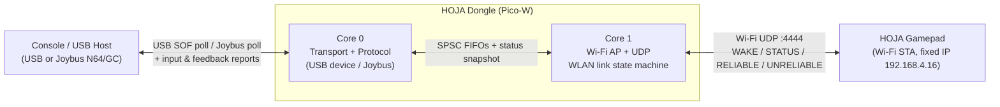
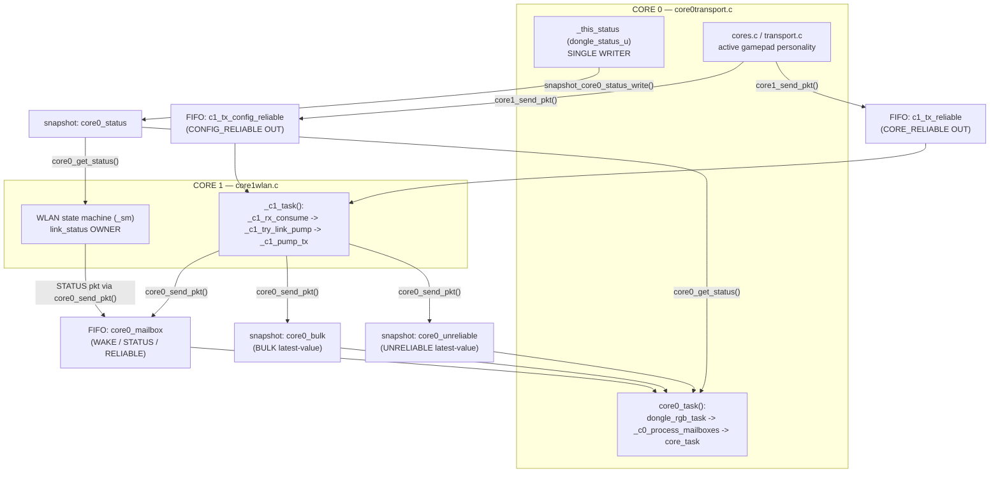
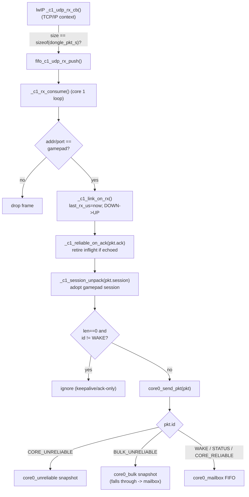
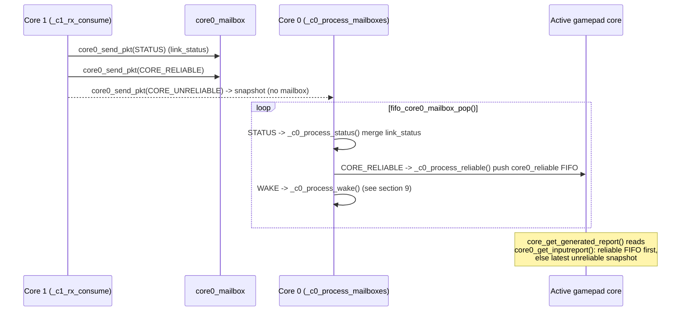
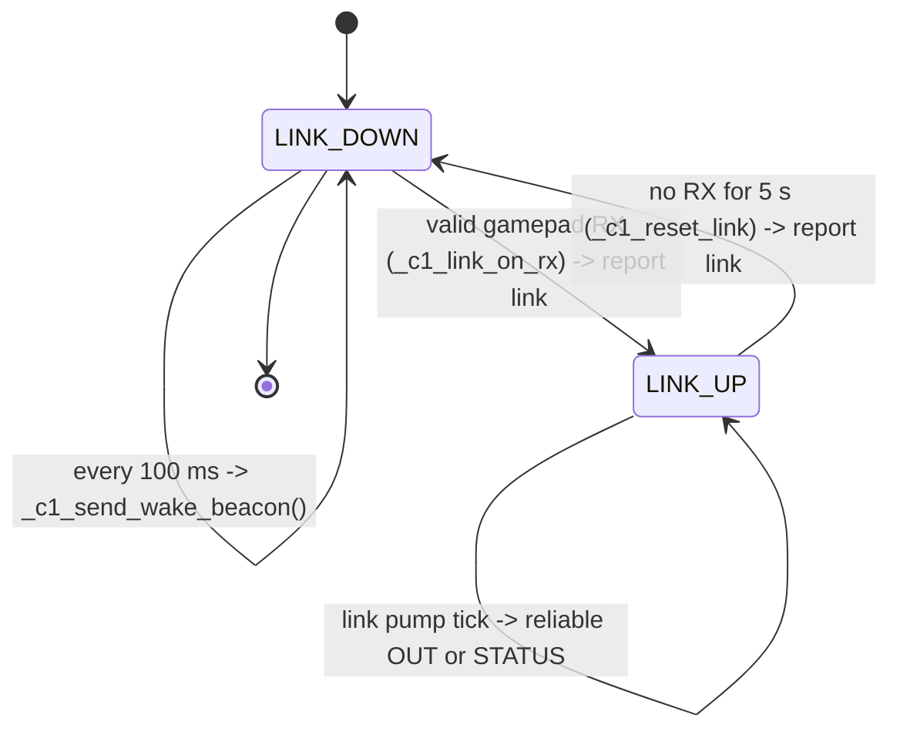
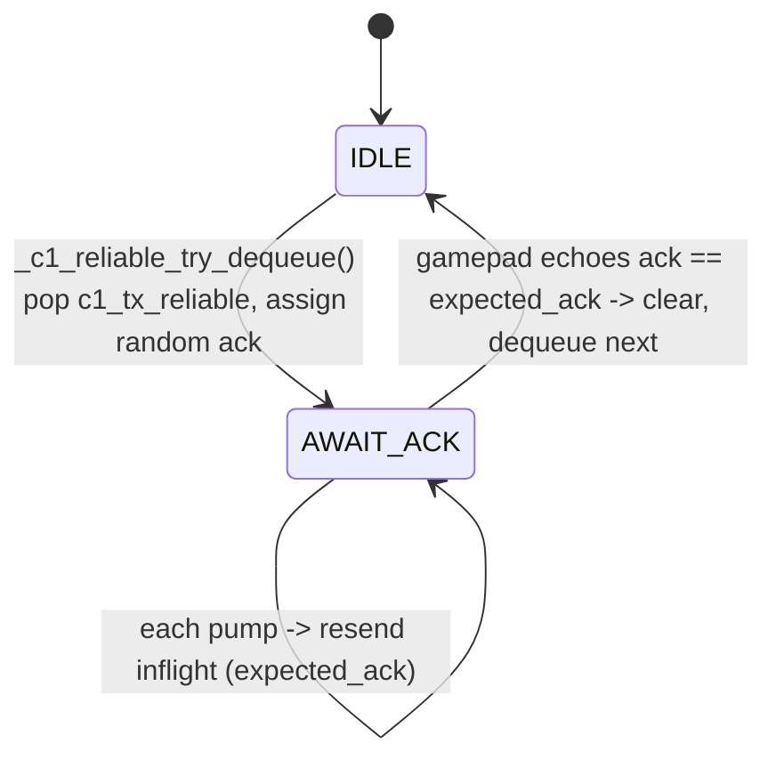
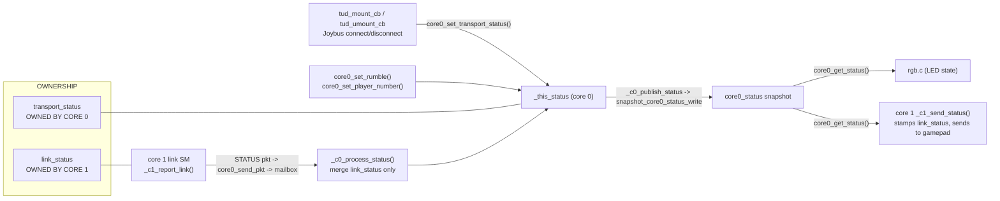
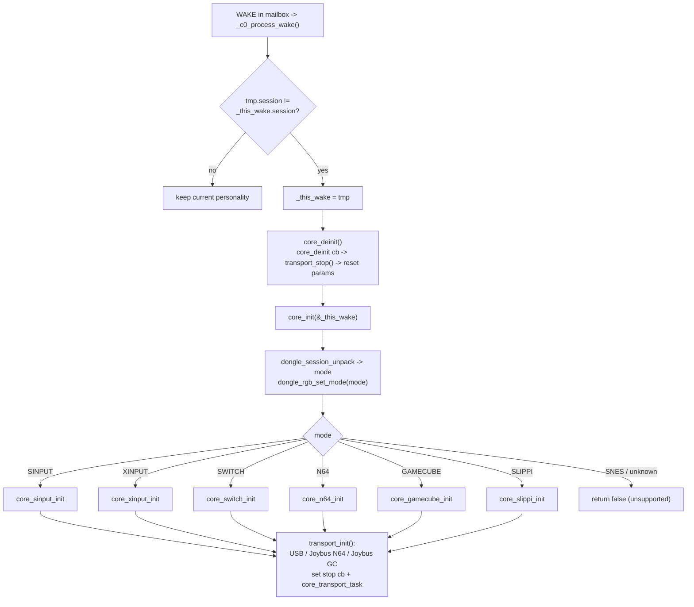
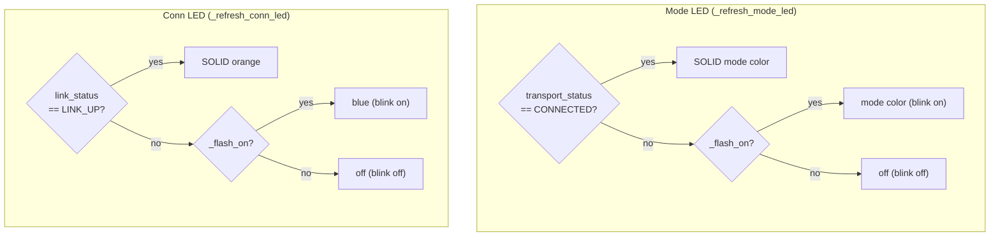

# HOJA Dongle Firmware — Control Flow

> Target: Raspberry Pi Pico‑W (RP2040, dual Cortex‑M0+), C. This document describes
> the runtime control flow of the `hoja-dongle-fw` and is verified against the
> firmware sources (`core0transport.c`, `core1wlan.c`, `cores.c`, `transport.c`,
> `usb_hal.c`, `rgb.c`, and the cross‑core primitives in `crosscore_fifo.h` /
> `crosscore_snapshot.h`).

## 1. System Summary

The dongle bridges a **wireless HOJA gamepad** to a **console / USB host**. It runs
two firmware halves on two cores. **Core 0** owns the console‑facing transport (a
TinyUSB device personality, or Joybus for N64 / GameCube), the **authoritative status
snapshot**, and all protocol decoding. **Core 1** owns the **Wi‑Fi radio**: it brings
up a SoftAP + DHCP server + a UDP socket, runs the WLAN **link state machine**, emits
WAKE beacons while searching, and performs **host‑paced** transmission to the gamepad.
The two cores never share locks; every shared object is a strict
single‑producer/single‑consumer (SPSC) FIFO or a seqlock snapshot. The wireless
protocol is **respond‑only**: the gamepad never transmits unsolicited — the dongle
drives all pacing, and each pump sends exactly one packet (a pending reliable OUT, or
a STATUS).

---

## 2. System Context



- Console side: USB device (HID / XInput / Slippi) **or** Joybus (N64 / GameCube),
  selected by the active *core* personality.
- Wireless side: SoftAP `HOJA_WLAN_1234`, AP IP `192.168.4.1`, gamepad fixed at
  `192.168.4.16`, UDP port `4444` (`DONGLE_WLAN_PORT`).

---

## 3. Dual‑Core Architecture & Cross‑Core Channels

Core 0 is the **single writer** of the status snapshot. Core 1 is the **single
producer** into core 0's inbox; core 0 is the **single producer** into core 1's TX
lanes. All channels obey SPSC.



Primitive choice (see `crosscore_fifo.h` / `crosscore_snapshot.h`):

| Channel | Primitive | Producer | Consumer | Why |
|---|---|---|---|---|
| `core0_mailbox` | SPSC FIFO | core 1 | core 0 | every WAKE/STATUS/RELIABLE must be kept, in order |
| `core0_unreliable` | seqlock snapshot | core 1 | core 0 | only the latest input report matters |
| `core0_bulk` | seqlock snapshot | core 1 | core 0 | latest bulk frame only |
| `core0_reliable` | SPSC FIFO | core 0 | gamepad core | queued IN reports for the active core |
| `c1_tx_reliable` | SPSC FIFO | core 0 | core 1 | reliable host→gamepad OUT, ack/resend |
| `c1_tx_config_reliable` | SPSC FIFO | core 0 | core 1 | reliable config OUT |
| `c1_udp_rx` | SPSC FIFO | lwIP cb | core 1 loop | move RX out of ISR/TCP‑IP context |
| `core0_status` | seqlock snapshot | core 0 | core 1 + rgb | latest authoritative status |

> Note on `core0_send_pkt()`: `CORE_UNRELIABLE` writes only the unreliable snapshot;
> `BULK_UNRELIABLE` writes the bulk snapshot and **falls through** into the mailbox
> push; everything else is pushed to the mailbox. The mailbox decoder only acts on
> `CORE_RELIABLE`, `STATUS`, and `WAKE`.

---

## 4. Boot / Initialization Sequence

`main()` runs on core 0; it launches core 1 with `multicore_launch_core1(core1_entry)`.

```mermaid
sequenceDiagram
    participant M as main() / Core 0
    participant RGB as rgb.c
    participant CORE as cores.c
    participant C1 as Core 1 (core1_entry)
    participant CYW as cyw43 / lwIP

    M->>RGB: dongle_rgb_enter_bootloader_if_buttons_held()
    Note over RGB: both buttons held -> reset_usb_boot() (no return)
    M->>M: stdio_init_all()
    M->>CORE: core_init(core_boot_wake())
    Note over CORE: boot session = GAMECUBE (default)<br/>dongle_rgb_set_mode(mode)<br/>transport_init() -> USB/Joybus
    M->>C1: multicore_launch_core1(core1_entry)
    M->>RGB: dongle_rgb_gpio_init()  (reclaim button pins after cyw43)
    M->>RGB: dongle_rgb_init()  (LED HAL, seed link/transport)
    M->>M: for(;;) core0_task(time_us_64())

    C1->>CYW: cyw43_arch_init_with_country(USA)
    C1->>CYW: enable_ap_mode(SSID, PASS, WPA2)
    C1->>CYW: dhcp_server_init(192.168.4.1/24)
    C1->>CYW: udp_new / udp_bind(:4444) / udp_recv(_c1_udp_rx_cb)
    C1->>C1: _c1_sm_init() -> LINK_DOWN, report link
    C1->>C1: for(;;) _c1_task(time_us_64())
```

Per‑loop work:

- **Core 0** `core0_task()`: `dongle_rgb_task()` → `_c0_process_mailboxes()` →
  `core_task()` (services the active transport/report).
- **Core 1** `_c1_task()`: `_c1_rx_consume()` → `_c1_try_link_pump()` → `_c1_pump_tx()`.

---

## 5. Inbound Packet Flow (Gamepad → Dongle)



Core 0 then decodes the mailbox in its task loop:



---

## 6. Outbound / Pacing Flow (Dongle → Gamepad), Steady State

Transmission while `LINK_UP` is driven **only** by the link pump, which is scheduled
from host poll timing (USB SOF or Joybus poll) and rate‑limited to ~500 Hz
(`C1_LINK_PUMP_MIN_INTERVAL_US = 1900 µs`).

```mermaid
sequenceDiagram
    participant Host as USB Host
    participant SOF as tud_sof_cb (1 kHz)
    participant PUMPSCHED as core1_link_pump_schedule_from_poll
    participant C1 as Core 1 (_c1_try_link_pump)
    participant GP as Gamepad
    participant TASK as transport_usb_task

    Host->>SOF: SOF (every 1 ms), ms_counter++
    alt ms_counter == _usb_frames/2 (mid-period)
        SOF->>PUMPSCHED: schedule pump at now + (interval/2)
    end
    alt ms_counter >= _usb_frames (end of poll period)
        SOF->>SOF: _usb_sendit = true; mark_sent(now)
        SOF->>PUMPSCHED: (if _usb_frames==1) schedule pump
    end

    Note over C1: when now_us >= _link_pump_at_us<br/>and >= 1900us since last pump
    C1->>C1: _c1_pump_link()
    alt reliable OUT inflight/available
        C1->>GP: CORE_RELIABLE (ack=expected_ack), resend until echoed
    else
        C1->>GP: STATUS (rumble/player/transport + link_status)
    end
    GP-->>C1: reply: CORE_UNRELIABLE input + ack echo
    Note over C1: _c1_rx_consume -> core0_send_pkt

    TASK->>Host: when _usb_sendit && _usb_ready:<br/>core_get_generated_report() -> tud_*_report()
```

- `core1_link_pump_mark_sent()` records the poll instant; the spacing between polls
  is halved to place the next pump deadline **between** host polls.
- USB mount/unmount drives `transport_status` (see section 8); the SOF callback is
  re‑enabled in `tud_mount_cb()`.

---

## 7. WLAN Link State Machine



Reliable host→gamepad sub‑lane (independent of link up/down, reset on teardown):



Key constants: `C1_WAKE_INTERVAL_US = 100 ms`, `C1_TIMEOUT_US = 5 s`,
`C1_LINK_PUMP_MIN_INTERVAL_US = 1900 µs`.

---

## 8. Status Data Flow (Single Writer)

`dongle_status_u` carries `link_status`, `transport_status`, `player_number`,
`rumble`, `brake`. Core 0 is the **only** writer of the snapshot.



So `link_status` makes a round trip: owned/measured by core 1 → reported to core 0 via
a STATUS mailbox packet → merged into core 0's snapshot → read back by core 1 (and by
rgb), with core 1 re‑stamping the live link value onto outbound STATUS packets.

---

## 9. Mode / WAKE Re‑init Flow

A WAKE packet carries a `session` (4‑bit mode + 12‑bit random id). A **changed
session** triggers a personality switch.



`core_boot_wake()` synthesizes the default boot session (`DONGLE_MODE_GAMECUBE`) so the
dongle is usable before the host/gamepad selects a mode.

---

## 10. RGB / Status LED Behavior

Two WS2812 LEDs: **mode LED** (transport‑driven) and **connection LED**
(link‑driven). Blink half‑period is 500 ms (`RGB_FLASH_PERIOD_US`). Buttons toggle
their LED on a 500 ms hold; both held at boot enters the UF2 bootloader.



Mode colors: Switch = white, SInput = blue, XInput = green, Slippi = cyan, N64 =
yellow, GameCube = purple, SNES = red. The blink phase is shared and only advances
while something is blinking; LED frames are pushed to the HAL only when state changes.

---

## 11. File / Module Glossary

| File | Role |
|---|---|
| `src/core0transport.c` | Core 0 engine: `main()`, boot/init, status snapshot writer, mailbox decode (WAKE/STATUS/RELIABLE), `core0_send_pkt`/`core0_get_status` API |
| `include/core0transport.h` | Core 0 cross‑core API: inbox entry, input/output report accessors, status setters/getter |
| `src/core1wlan.c` | Core 1 engine: cyw43 AP + DHCP + UDP, WLAN link SM, WAKE beacons, reliable ACK lane, link pump, `_c1_rx_consume` → `core0_send_pkt` |
| `include/core1wlan.h` | Core 1 cross‑core API: `core1_send_pkt`, `core1_entry`, link‑pump scheduling hooks |
| `src/cores/cores.c` | Active personality dispatch: `core_boot_wake`, `core_init` (mode → core), `core_task`, `core_deinit` |
| `src/transport/transport.c` | Transport backend selection: USB / Joybus N64 / Joybus GC; `transport_init`/`transport_stop`/task wiring |
| `src/hal/usb_hal.c` | TinyUSB glue: descriptors, HID/XInput/Slippi class drivers, SOF pump (`core1_link_pump_schedule_from_poll`/`mark_sent`), `tud_mount/umount` → transport status |
| `src/hal/joybus_n64_hal.c` / `joybus_gc_hal.c` | Joybus N64 / GameCube PIO transport HAL |
| `src/utilities/rgb.c` | Dual status LEDs + buttons: mode LED (transport blink/solid), conn LED (link), bootloader entry |
| `include/utilities/crosscore_fifo.h` | SPSC lock‑free FIFO template (single‑writer indices, release/acquire) |
| `include/utilities/crosscore_snapshot.h` | Seqlock latest‑value snapshot template (single writer/reader, stale fallback) |
| `external/HOJA-LIB-DONGLE/include/dongle.h` | Wire types: `dongle_pkt_s`, `dongle_status_u`, `dongle_session_s`/`dongle_wake_s`, `dongle_pid_t`, `dongle_mode_t`, fixed IP/port |

### Wire reference (`dongle.h`)

- **Packet IDs (`dongle_pid_t`):** `WAKE=0`, `CORE_RELIABLE=1`, `CORE_UNRELIABLE=2`,
  `STATUS=3`, `BULK_UNRELIABLE=4`, `CONFIG_RELIABLE=5`.
- **Packet (`dongle_pkt_s`):** `session(u16)`, `ack(u16)`, `id(u8)`, `len(u16)`,
  `data[64]`.
- **Status (`dongle_status_u`):** `link_status`, `transport_status`, `player_number`,
  `rumble{left,right}`, `brake{left,right}`.
- **Endpoints:** AP `192.168.4.1`, gamepad `192.168.4.16`, UDP `4444`.
